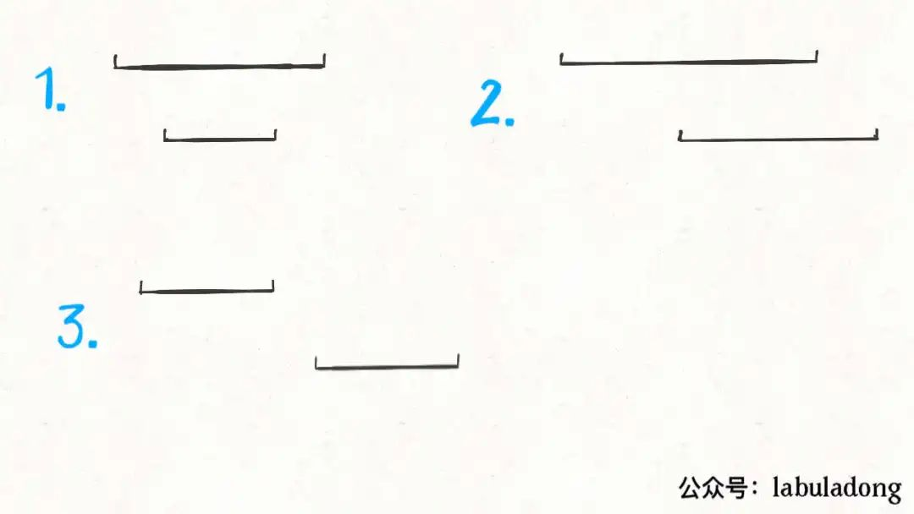
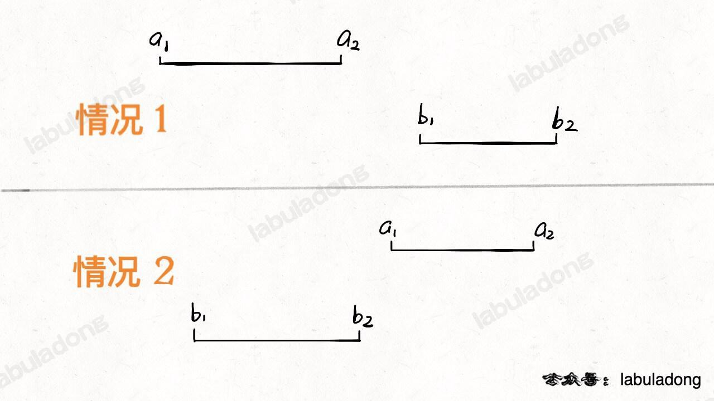
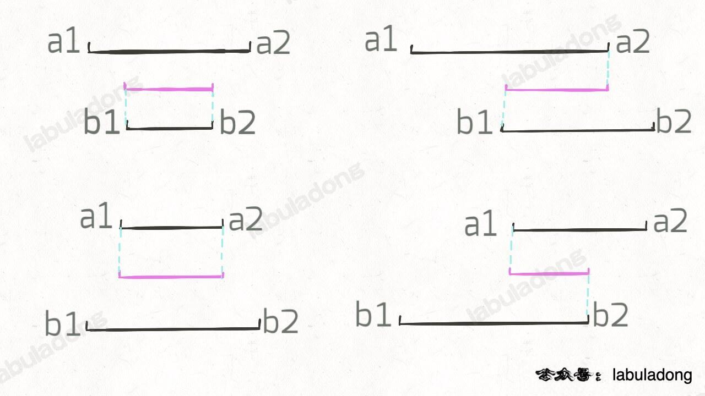

# leetcode_56_mergee_intervals

多个数组按有序排列，合并相交的数组

[1, 4]
[3, 6]
[8, 12]
[9, 10]

第一个元素先存储 
遍历剩下的元素时， 与前一个元素进行比较， 如果是小于当前元素的，说明存在交集
如果是大于当前元素的，说明不存在交集， 将当前元素存入结果数组

```java
        Arrays.sort(intervals, Comparator.comparingInt(a -> a[0]));
        List<int[]> res = new ArrayList<>();
        res.add(intervals[0]);
        for (int i = 1; i < size; i++) {
            int[] cur = intervals[i];
            int[] pre = res.get(res.size() - 1);
            if (pre[1] < cur[0]) {
                res.add(cur);
            } else {
                pre[1] = Math.max(pre[1], cur[1]);
            }
        }
        return res.toArray(new int[res.size()][]);
```


leetcode_1288_Remove_Covered_Intervals
Example 1:

Input: intervals = [[1,4],[3,6],[2,8]]
Output: 2
Explanation: Interval [3,6] is covered by [2,8], therefore it is removed.

Example 2:
Input: intervals = [[1,4],[2,3]]
Output: 1

对数组进行排序，排序后两个相邻的数组， 要么存在子集， 要么相交， 要么不相交



```java
public int removeCoveredIntervals(int[][] intervals) {

        if(intervals.length == 0) return 0;

        Arrays.sort(intervals, (a, b) -> {
            if(a[0] == b[0]) {
                // 相同起点，大的在前多消一次
                return b[1] - a[1];
            }
            return a[0] - b[0];
        });
        // 区间覆盖， 区间相交-扩大， 区间无交集-更新下标， 统计相交的个数
        int left = intervals[0][0];
        int right = intervals[0][1];
        int res  = 0;

        for(int i=1; i<intervals.length; i++) {
            int[] cur = intervals[i];

            if(left <= cur[0] && right >= cur[1]) {
                res++;
            } else if(cur[0] < right) {
                right = cur[1];
            } else {
                left = cur[0];
                right = cur[1];
            }

        }
        return intervals.length-res;

    }
```

第三种情况
firstList = [[0,2],[5,10],[13,23],[24,25]], secondList = [[1,5],[8,12],[15,24],[25,26]]
输出：[[1,2],[5,5],[8,10],[15,23],[24,24],[25,25]]


首先找到两个数组无交集的情况



```java
if b2 < a1 or a2 < b1:
    [a1,a2] 和 [b1,b2] 无交集
```

存在交集的情况 [max(a1,b1)  min(a2,b2)]

```java



```java

    public int[][] intervalIntersection(int[][] firstList, int[][] secondList) {

        // 不相交的情况
        List<int[]> res = new ArrayList<>();
        int i = 0, j = 0;

        int length1 = firstList.length, length2 = secondList.length;

        while (i < length1 && j < length2) {
            int[] a = firstList[i];
            int[] b = secondList[j];

            int low = Math.max(a[0], b[0]);
            int high = Math.min(a[1], b[1]);
            if (low <= high) {
                res.add(new int[]{low, high});
            }
            if (a[1] < b[1]) {
                i++;
            } else {
                j++;
            }
        }
        return res.toArray(new int[0][]);

    }

```